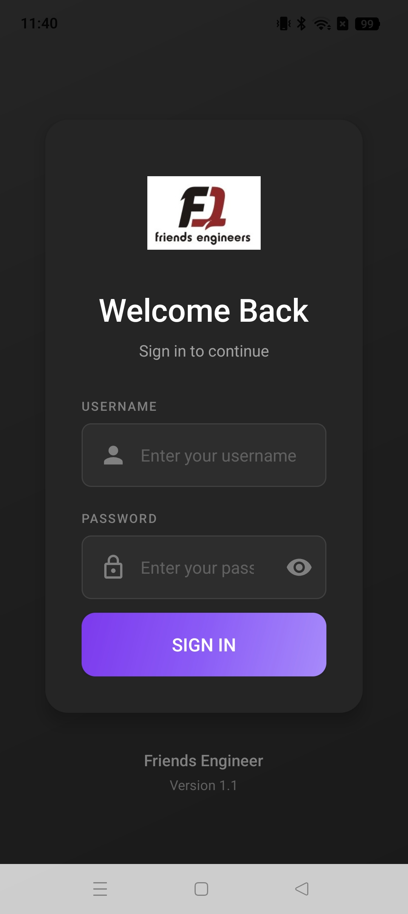
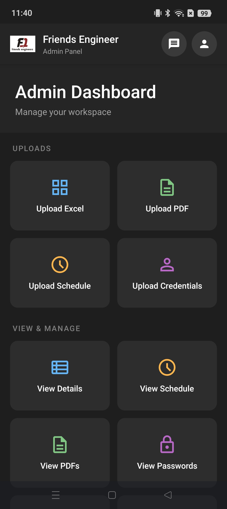
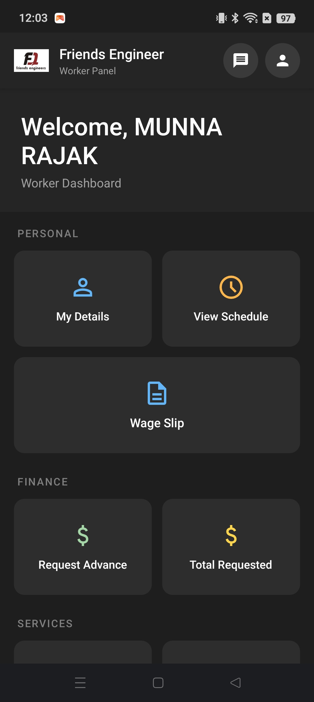
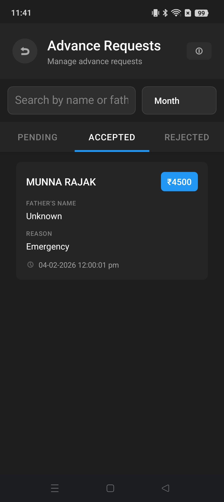
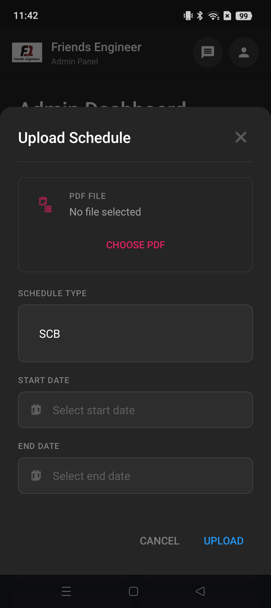

# Friends Engineers App

An Android app (Java/XML) designed to manage worker data, authentication, schedules, and document sharing between Admins and Workers using Firebase Firestore.

## 📱 Download

[](https://play.google.com/store/apps/details?id=com.jitendersingh.friendsengineer)

**My Setu** is now available on the Google Play Store!  
[Download from Play Store](https://play.google.com/store/apps/details?id=com.jitendersingh.friendsengineer)

## ✨ Features

🔐 **Login System (Admin & Worker)**
- Secure login with username & password stored in Firestore.
- Separate dashboards for Admin and Worker.

👤 **Worker Management**
- Admins can enter and manage worker details.
- Workers can view their own profiles.

📄 **Schedule Upload**
- Admin can upload department-wise schedule PDFs.
- Workers see schedules based on their department.

💰 **Advance Request System**
- Workers can request advances (up to 2 times/month).
- Admins can accept full, partial, or reject requests.
- Advance history is visible to both Admins and Workers.

📊 **PDF/Excel Mapping**
- Admin can upload a PDF and Excel list of workers.
- App maps each PDF page to corresponding worker from Excel.
- Workers can view only their assigned PDF page.

📁 **Custom Excel Upload**
- Workers can upload Excel files with any number of columns.
- Data is stored in Firestore in a structured format.
- Admins can view submitted data neatly.

🌐 **External Portals**
- Two shortcut buttons redirect Workers to external web portals.

---

## 🔧 Tech Stack

- **Android Studio**
- **Java & XML**
- **Firebase Firestore**
- **Firebase Storage**
- **PDF/Excel File Processing**

---

## 📸 Screenshots

### Login Page


### Admin Dashboard


### Worker Dashboard


### Advance Request


### Schedule View


---

## 🚀 Getting Started

### ✅ Prerequisites

- Android Studio Arctic Fox or later  
- Firebase Project with Firestore and Storage enabled  
- Java 8 or above  

---

### ⚙️ Installation

1. Clone the repository:  
   ```bash
   git clone https://github.com/rahul-singh92/Friends-Enginners-App.git
   
2. Open the project in Android Studio.
3. Connect it to your Firebase project:
   - Add your google-services.json file to the app/ directory.
   - Enable Firestore and Firebase Storage in the Firebase Console.
4. Sync Gradle and run the app on your emulator or device.

---

### 🤝 Contributing
- Pull requests are welcome! For major changes, please open an issue first to discuss what you'd like to change or add.

---

### 📄 License
- This project is licensed under the MIT License — see the [LICENSE](LICENSE) file for details.

--- 

### 📬 Contact
- Rahul Singh Jadoun
- 📧 rahulsinghjadoun09@gmail.com
- 🔗 Friends Engineers App

