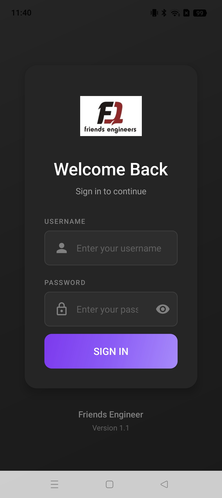
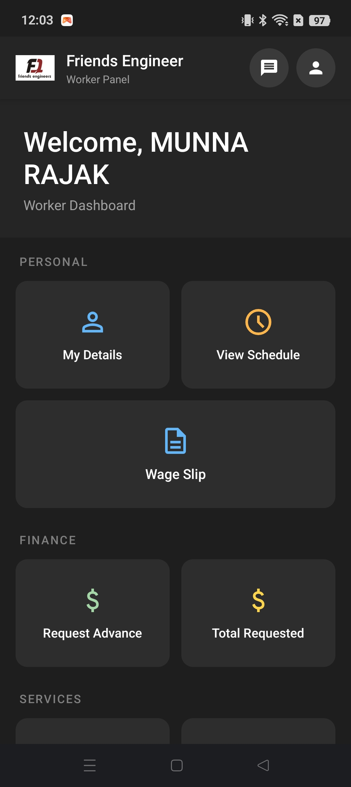
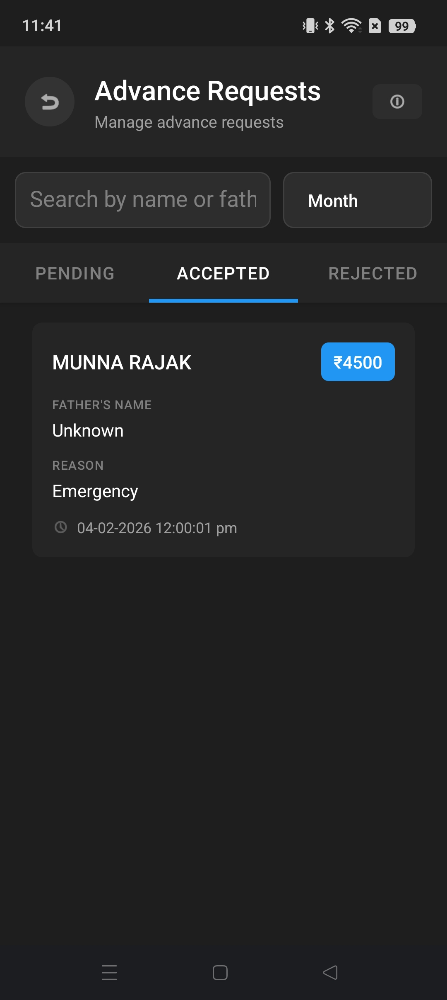
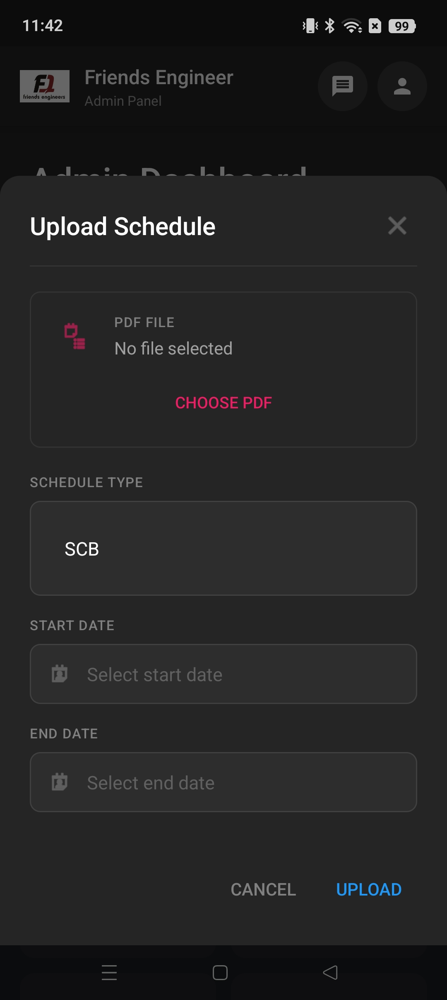

# Friends Engineers App

An Android app (Java/XML) designed to manage worker data, authentication, schedules, and document sharing between Admins and Workers using Firebase Firestore.

## Download

**My Setu** is now available on the Google Play Store!  
[Download from Play Store](https://play.google.com/store/apps/details?id=com.jitendersingh.friendsengineer)

## Features

**Login System (Admin & Worker)**
- Secure login with username & password stored in Firestore.
- Separate dashboards for Admin and Worker.

**Worker Management**
- Admins can enter and manage worker details.
- Workers can view their own profiles.

**Schedule Upload**
- Admin can upload department-wise schedule PDFs.
- Workers see schedules based on their department.

**Advance Request System**
- Workers can request advances (up to 2 times/month).
- Admins can accept full, partial, or reject requests.
- Advance history is visible to both Admins and Workers.

**PDF/Excel Mapping**
- Admin can upload a PDF and Excel list of workers.
- App maps each PDF page to corresponding worker from Excel.
- Workers can view only their assigned PDF page.

**Custom Excel Upload**
- Workers can upload Excel files with any number of columns.
- Data is stored in Firestore in a structured format.
- Admins can view submitted data neatly.

**External Portals**
- Two shortcut buttons redirect Workers to external web portals.

---

## Tech Stack

- **Android Studio**
- **Java & XML**
- **Firebase Firestore**
- **Firebase Storage**
- **PDF/Excel File Processing**

---

## Screenshots

### Login Page

### Admin Dashboard

### Worker Dashboard

### Advance Request

### Schedule View

---

### 📄 License
- This project is licensed under the MIT License — see the [LICENSE](LICENSE) file for details.

--- 

### 📬 Contact
- Rahul Singh Jadoun
-  rahulsinghjadoun09@gmail.com
-  Friends Engineers App

