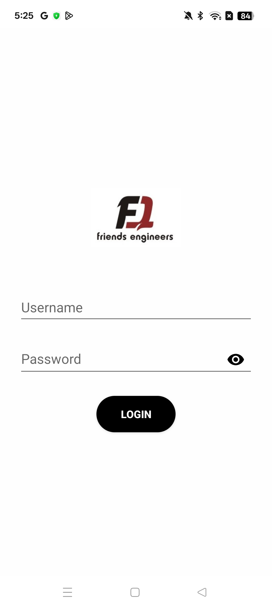
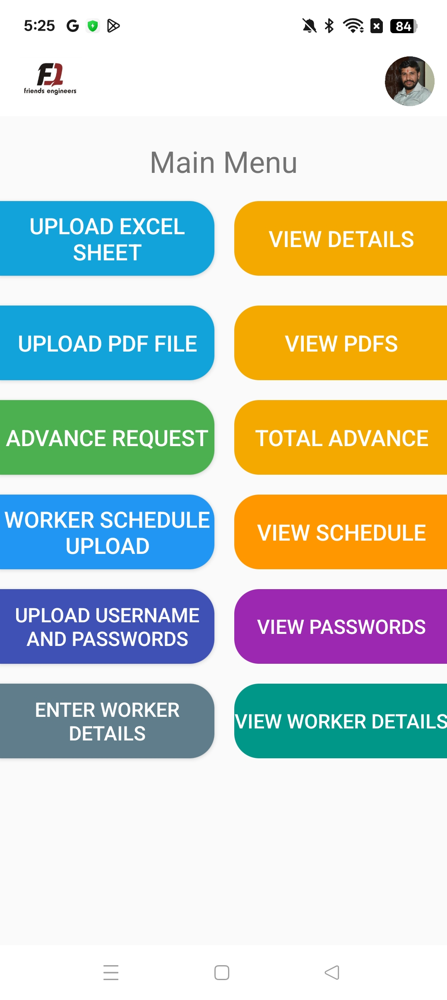
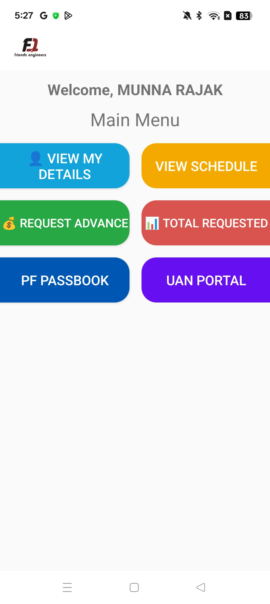
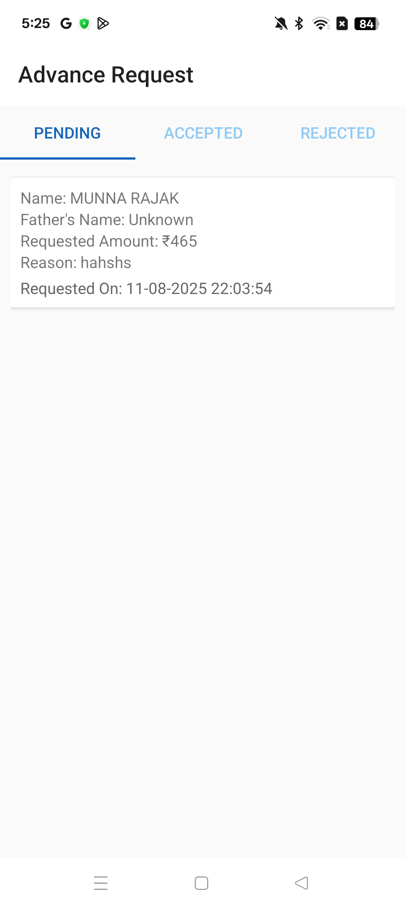

# Friends Engineers App

An Android app (Java/XML) designed to manage worker data, authentication, schedules, and document sharing between Admins and Workers using Firebase Firestore.

## ✨ Features

🔐 **Login System (Admin & Worker)**
- Secure login with username & password stored in Firestore.
- Separate dashboards for Admin and Worker.

👤 **Worker Management**
- Admins can enter and manage worker details.
- Workers can view their own profiles.

📄 **Schedule Upload**
- Admin can upload department-wise schedule PDFs.
- Workers see schedules based on their department.

💰 **Advance Request System**
- Workers can request advances (up to 2 times/month).
- Admins can accept full, partial, or reject requests.
- Advance history is visible to both Admins and Workers.

📊 **PDF/Excel Mapping**
- Admin can upload a PDF and Excel list of workers.
- App maps each PDF page to corresponding worker from Excel.
- Workers can view only their assigned PDF page.

📁 **Custom Excel Upload**
- Workers can upload Excel files with any number of columns.
- Data is stored in Firestore in a structured format.
- Admins can view submitted data neatly.

🌐 **External Portals**
- Two shortcut buttons redirect Workers to external web portals.

---

## 🔧 Tech Stack

- **Android Studio**
- **Java & XML**
- **Firebase Firestore**
- **Firebase Storage**
- **PDF/Excel File Processing**

---

## 📸 Screenshots

### Login Page

### Admin Dashboard

### Worker Dashboard

### Advance Request

### Schedule View

